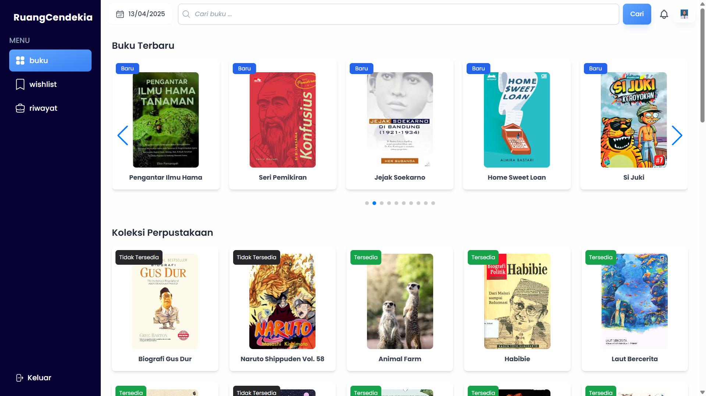
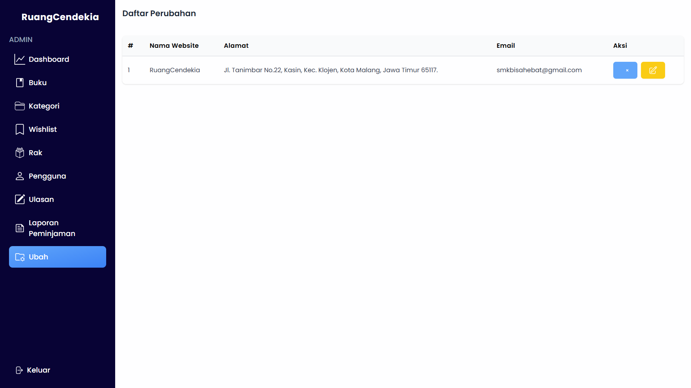

# Documentation ilibray

Ruang Cendekia adalah platform perpustakaan digital yang memudahkan pengguna dalam meminjam buku secara online. Dengan fitur booking buku yang praktis, pengguna dapat mengecek ketersediaan koleksi, melakukan pemesanan, dan mengatur jadwal pengambilan dengan cepat. Website ini dirancang untuk mendukung kegiatan literasi dengan akses mudah, katalog lengkap, dan sistem peminjaman yang efisien.

## Fitur Fitur

-   _Admin_

    -   Melakukan Login
    -   Mencari Buku
    -   Menambahkan Buku
    -   Memperbarui Buku
    -   Menghapus Buku
    -   Mengembalikan Buku
    -   Menambahkan Kategori Buku
    -   Memperbarui Kategori Buku
    -   Menghapus Kategori
    -   Melihat WIshlit
    -   Menambah Rak 
    -   Memperbarui Rak
    -   Melihat Detail Rak
    -   Menghapus Rak
    -   Melihat Daftar Pengguna
    -   Menghapus Ulasan
    -   Melihat Laporan Peminjaman
    -   Mengubah Tampilan Landing 

-   _Admin_

    -   Melakukan Login
    -   Mencari Buku
    -   Menambahkan Buku
    -   Memperbarui Buku
    -   Menghapus Buku
    -   Mengembalikan Buku
    -   Menambahkan Kategori Buku
    -   Memperbarui Kategori Buku
    -   Mengkonfirmasi Peminjaman
    -   Mengubah status pinjaman
    -   Mengubah status denda
    -   Menghapus Kategori
    -   Melihat WIshlit
    -   Menambah Rak 
    -   Memperbarui Rak
    -   Melihat Detail Rak
    -   Menghapus Rak
    -   Menambah Daftar Pengguna
    -   Mengubah Data Pengguna
    -   Menghapus Data Pengguna
    -   Menghapus Ulasan
    -   Melihat Laporan Peminjaman
    -   Mengubah Tampilan Landing 

-   _User_

    -   Melakukan Login
    -   Mencari Buku
    -   Meminjam Buku
    -   Memasukkan buku ke Wishlist
    -   Menghapus buku dari Wishlist
    -   Melihat Riwayat Peminjaman
    -   Melihat Notifikasi
    -   Mengubah data profil

## Tech Stack

-   HTML
-   CSS
-   Bootsrap
-   PHP
-   Laravel
-   MySQL

## Install Project

### Clone Repository

git clone https://github.com/gitapr30/Ruang-Cendekia.git

### Download Zip

extract file zip

## Buka di kode editor

### Install composer

composer install

### Install composer

copy .env.example menjadi .env

### Buka Web Server

## Buat database di localhost

nama database : laravel

## Setting database di .env

DB_PORT=3306
DB_DATABASE=laravel
DB_USERNAME=root
DB_PASSWORD=

## Generate key

php artisan key:generate

## Jalankan migrate dan seeder

php artisan migrate --seed

## Buat Storage Link

php artisan storage:link

## Jalankan Serve 

php artisan serve

## Screenshot

-   _tampilan - tampilan_

    -   Landing

        

    -   Login

        

    -   Buku user

        

    -   Wishlist user

        

    -   Riwayat user

        

    -   Detail buku

        

    -   Dashboard

        

    -   Buku

        

    -   kategori

        

    -   Konfirmasi Peminjaman

        

    -   Buku Dipinjam

        

    -   Buku Dikembalikan

        
        
    -   Denda

        

    -   Wishlist

        

    -   Rak

        

    -   Pengguna Pustakawan

        

    -   Pengguna Admin

        

    -   Ulasan

        

    -   Laporan Peminjaman

        

    -   Customize

        

